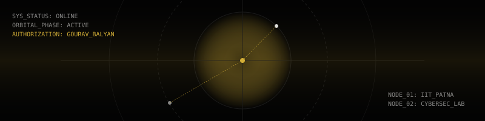

<!-- 
  =============================================================================
    GOURAV BALYAN — GitHub Profile README (COSMIC TERMINAL EDITION)
    Identity: Student / AI & Cyber-Security
    Aesthetic: Stealth Monolithic (V4.1)
  ============================================================================= 
-->

<div align="center">
  
</div>

<h1 align="center">
  
</h1>

<br />

<div align="center">
  
  
  
  
</div>

<br />

### ▓ 01 // DOSSIER

```yaml
operator       : Gourav Balyan
classification : [ "Pre-College Builder", "Systems Architect in Training" ]
education      : IIT Patna — Hybrid BS in AI & Cybersecurity
core_directive : "Building AI-powered business solutions & complex workflows"
philosophy     : function > form · automation > manual · stealth > loud
current_status : [ "Exploring cutting-edge AI", "Learning in public" ]
contact_link   : https://linkedin.com/in/gouravofficial/
```

<br />

### ▓ 02 // ORBITAL METRICS

<div align="center">
  
  
</div>

<br />

### ▓ 03 // TECH STACK [ NODE ALIGNMENT ]

```json
{
  "FrontEnd": ["HTML", "CSS (Neo-Brutalist)", "Next.js", "Three.js (WebGL)"],
  "BackEnd": ["Python", "Node.js"],
  "Infrastructure": ["Vercel", "GitHub", "AI Orchestration APIs"]
}
```

<br />

<div align="center">
  <sub><b>SYSTEM NOTE:</b> This profile interface is running on <b>Cosmic Terminal V4.1</b>.</sub>
</div>
