<picture>
  <source media="(prefers-color-scheme: dark)" srcset="./assets/linkedin-hero.svg">
  <source media="(prefers-color-scheme: light)" srcset="./assets/linkedin-hero.svg">
  
</picture>

 

---

## 💼 Professional Experience

### Lead AI Orchestrator & Product Architect
**Hackknow (Startup)** • *Core Early Member*  
*Mid March 2026 – Early May 2026*
- Spearheaded the architectural design of the core AI orchestration engine from scratch.
- Engineered autonomous enterprise workflows, scaling internal operations rapidly.

### Data Product Architect
**Independent Build Series** • *High-Volume Systems*  
*Mar 2026 – Apr 2026*
- Engineered **Corporate_Payroll_Burn_Engine**: High-volume financial risk intelligence.
- Architected **Enterprise_RevOps_Terminal**: Zero-latency cohort comparison engine.
- Directed AI-driven Python logic to process 4.8M rows of market data in sub-10s execution.

---

## 🎓 Academic Background

**Indian Institute of Technology (IIT) Patna**  
Hybrid BS in **AI & Cybersecurity** | *Jul 2026 – Jul 2030 (Expected)* • **CURRENT**

**I.T.B.P. Public School**  
10th & 12th Class • Sec:16-B, Dwarka, Delhi

---

## 🚀 Professional Capabilities & Skills

  
  
  
  
  

- **AI Code Orchestration**: Designing autonomous workflows & agentic LLM infrastructure.
- **Data Product Architecture**: Engineering high-volume ETL pipelines with sub-second execution speeds.
- **Business Logic Translation**: Bridging corporate operations with scalable, automated logic models.
- **Cybersecurity (Ongoing)**: Exploring system hardening, threat modeling, and secure architectures.

---

## 📊 GitHub Stats

  
   
  

