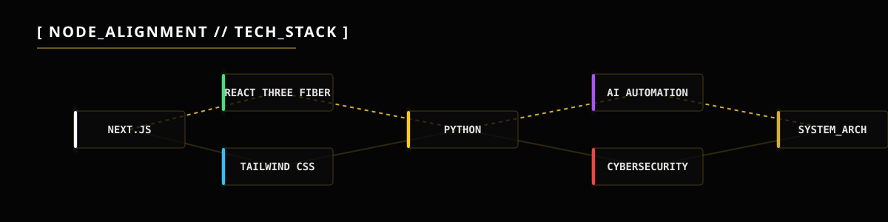

<picture>
  <source media="(prefers-color-scheme: dark)" srcset="./assets/cosmic-dashboard.svg">
  <source media="(prefers-color-scheme: light)" srcset="./assets/cosmic-dashboard.svg">
  
</picture>

<picture>
  <source media="(prefers-color-scheme: dark)" srcset="./assets/tech-stack.svg">
  <source media="(prefers-color-scheme: light)" srcset="./assets/tech-stack.svg">
  
</picture>

